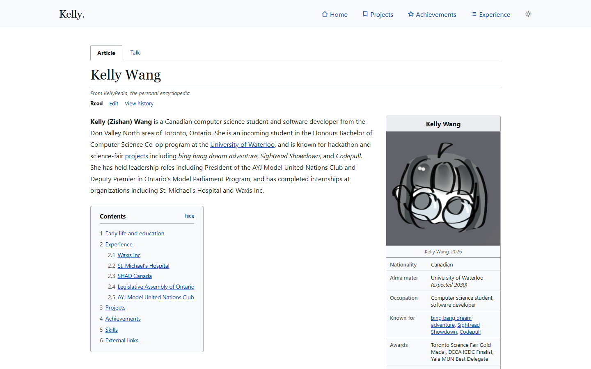
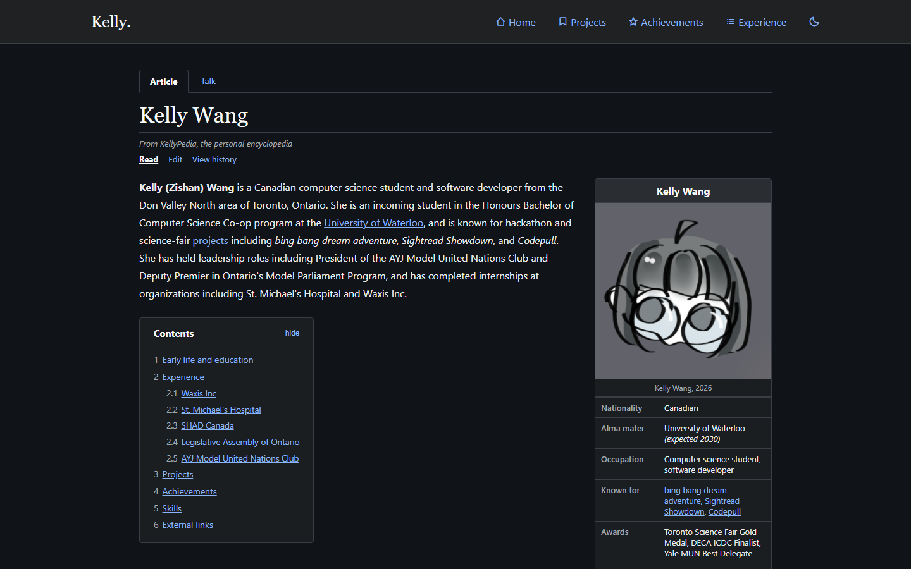
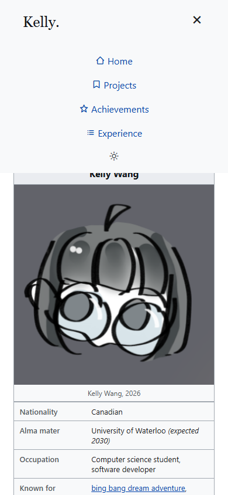

# Description
Personal website! 9.2026 overhaul of old UI, redesigned as "KellyPedia", a personal site inspired by the style of a Wikipedia article. (Projects, Achievements, and Experience pages WIP)

## Tech Stack
- HTML used to build pages of the website
- CSS used for custom layout and UI
- JavaScript used for interactive elements (theme toggle, hamburger menu, contents box show/hide)

## Motivation
Old website was not compatible with mobile, so the new updated aimed to fix the resize for different screens (implemented breakpoints for screen resize, hamburger menu). 

I didn't really like the old UI (and my secret narcissistic wish has always been wikipedia article about myself), so I decided to parody their website.

## How it Works
Individual size breakpoints (laptop, tablet, phone) determine the layout of the app on different devices. Also implemented dark mode, toggled by the sun/moon icon, and preference will be remembered in 'localStorage'

**Desktop, light mode**

**Desktop, dark mode**

**Mobile, collapsed navbar**

**Mobile, hamburger menu open**

## Next Steps
Expand the Projects, Achievements, and Experience stub pages into their own full pages instead of pointing back to the homepage sections

More custom UI (backgrounds and images)

Add more images and videos
## AI Usage
Copilot was used in conjunction with human writing and Claude to write the code used for this project.
